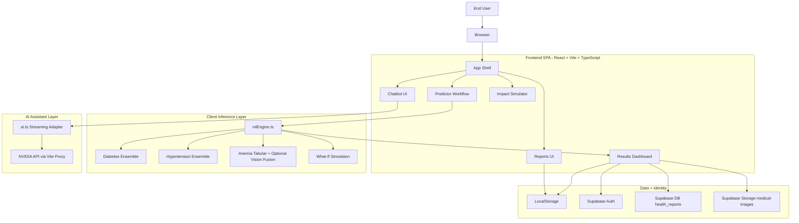
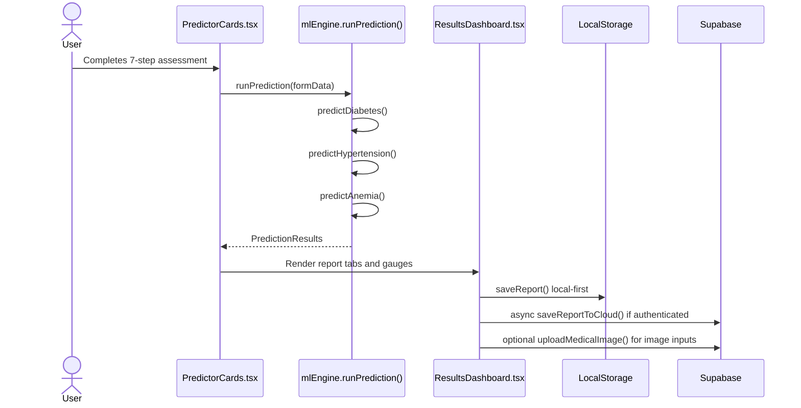
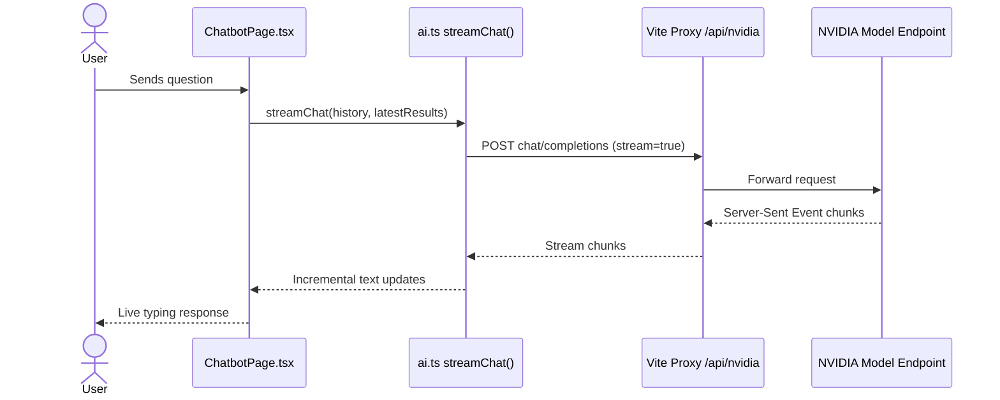
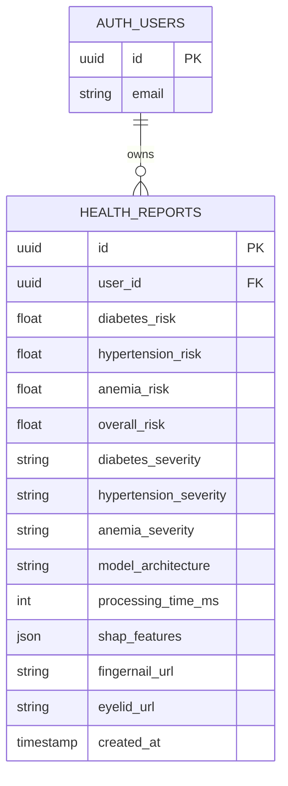

# PreventX

PreventX is a multilingual AI health companion focused on early risk screening for three high-impact conditions in India:

- Diabetes
- Hypertension
- Anemia

The app combines structured questionnaire data, optional image-assisted anemia screening, explainable risk outputs, and a streaming AI health coach experience.

## 1. Product Overview

PreventX is designed as a client-first healthcare screening platform for Bharat contexts (urban + rural), with support for English, Hindi, and Marathi. It is not a diagnostic system. It is a risk-screening and health guidance system.

### Key capabilities

- Guided 7-section health assessment workflow
- Disease risk scoring for diabetes, hypertension, and anemia
- Explainability via SHAP-style feature attribution
- Model breakdown tab for per-model prediction visibility
- What-if simulation for lifestyle change impact projection
- AI chat assistant that uses latest risk context
- Local-first report persistence with optional cloud sync
- Supabase authentication for per-user session separation
- Impact simulator for population-level intervention estimates
- Offline caching behavior via service worker

## 2. High-Level Architecture



## 3. Functional Modules

### 3.1 App shell and navigation

- Entry point: `src/main.tsx`
- Root orchestrator: `src/App.tsx`
- Main pages:
   - `Dashboard`
   - `Disease Predictor`
   - `Health AI Chat`
   - `Precautions`
   - `Impact Simulator`
   - `Reports`
   - `Settings`

### 3.2 Authentication and user session boundaries

- Login/Signup UI uses Supabase email-password auth
- Session check occurs at app boot
- Local report cache is reset when user identity changes
- Key local storage identity marker: `preventx_last_user_id`

### 3.3 Disease prediction workflow

The predictor flow (`src/components/PredictorCards.tsx`) is a 7-step questionnaire with validation:

1. Basic profile (age, sex, anthropometrics)
2. Family history
3. Lifestyle and longitudinal factors
4. Diet patterns
5. Medical history
6. Symptoms
7. Optional camera inputs + home BP

After completion, data is mapped into `FormDataInput` and sent to `runPrediction()` in `src/lib/mlEngine.ts`.

### 3.4 Explainability and simulation

- SHAP-like per-feature contributions are generated and sorted by influence
- Results dashboard has tabs for:
   - Risk overview
   - Explainability
   - Model ensemble breakdown
   - What-if simulator
- What-if simulator calls `simulateWhatIf()` and recomputes projections from adjusted lifestyle inputs

### 3.5 AI chat coach

- Chat UI in `src/components/ChatbotPage.tsx`
- Streaming adapter in `src/lib/ai.ts`
- Latest assessment context (if available) is injected as system context
- API calls route through Vite proxy: `/api/nvidia` -> `https://integrate.api.nvidia.com/v1`

### 3.6 Reports and impact tools

- Reports page reads historical prediction data from local storage
- Trend charts are rendered with Recharts
- Impact simulator estimates preventable cases and cost savings from prevalence assumptions

## 4. Prediction Engine Details

`src/lib/mlEngine.ts` contains client-side simulation of ensemble pipelines.

### 4.1 Diabetes pipeline

- Simulated architecture: XGBoost + DNN + RandomForest stacking
- Uses symptom, anthropometric, family history, and lifestyle mappings
- Produces:
   - risk (0-100)
   - severity bucket
   - confidence
   - model breakdown
   - top SHAP-style features

### 4.2 Hypertension pipeline

- Simulated architecture: XGBoost + LightGBM + RandomForest weighted fusion
- Strongly weighted on BMI, family history, smoking, stress, and BP history

### 4.3 Anemia pipeline

- Base tabular risk from symptom + medical factors
- Optional vision-assisted branch if eyelid/fingernail image exists
- Late fusion combines tabular and vision score when images are available

### 4.4 Global risk aggregation

Overall risk is computed as:

`overallRisk = round(0.35 * diabetes + 0.35 * hypertension + 0.30 * anemia)`

### 4.5 Severity thresholds

- Low: <= 35
- Moderate: 36-55
- High: 56-75
- Critical: > 75

## 5. End-to-End Prediction Flow



## 6. AI Chat Streaming Flow



## 7. Data Model and Persistence

### 7.1 Local storage keys

- `preventx_reports`: array of latest reports (trimmed to last 50)
- `preventx_last_user_id`: identity boundary for local cache isolation

### 7.2 Cloud storage behavior

Cloud sync is non-blocking and best-effort:

- Saves report metrics to `health_reports`
- Uploads optional medical images to `medical-images` bucket
- Stores generated image URLs with report record

### 7.3 Logical report schema



## 8. Service Worker and Offline Strategy

Service worker file: `_service-worker.js`

Current behavior:

- Precaches a small static list (`/`, `/index.html`, and selected source paths)
- Uses network-first fetch with cache fallback
- Falls back to `index.html` when offline
- Ignores cross-origin requests in SW handler (browser handles them)

Note: for production-grade PWA behavior on Vite builds, precache should target built `dist` assets with hashed filenames.

## 9. Technology Stack

### Frontend

- React 19
- TypeScript
- Vite 6
- Tailwind CSS 4
- motion/react (animations)
- Recharts (charts)
- lucide-react (icons)

### Data and auth

- Supabase JS client

### AI integration

- NVIDIA endpoint integration via browser fetch + Vite proxy

## 10. Repository Structure

```text
.
|- _service-worker.js
|- index.html
|- metadata.json
|- package.json
|- README.md
|- tsconfig.json
|- vite.config.ts
|- src/
|  |- App.tsx
|  |- main.tsx
|  |- index.css
|  |- types.ts
|  |- components/
|  |  |- Dashboard.tsx
|  |  |- PredictorCards.tsx
|  |  |- ResultsDashboard.tsx
|  |  |- WhatIfSimulator.tsx
|  |  |- ChatbotPage.tsx
|  |  |- PrecautionsPage.tsx
|  |  |- ImpactSimulatorPage.tsx
|  |  |- ReportsPage.tsx
|  |  |- Sidebar.tsx
|  |  |- TopBar.tsx
|  |  |- MedicalBodyMap.tsx
|  |  |- RiskGauge.tsx
|  |  |- SHAPChart.tsx
|  |- lib/
|  |  |- mlEngine.ts
|  |  |- ai.ts
|  |  |- supabase.ts
|  |  |- utils.ts
|- scratch/
|  |- validation_test.ts
```

## 11. Local Development Setup

### Prerequisites

- Node.js 18+ (20+ recommended)
- npm

### Install

```bash
npm install
```

### Environment configuration

Create `.env.local` in project root (recommended):

```bash
VITE_SUPABASE_URL=your_supabase_project_url
VITE_SUPABASE_ANON_KEY=your_supabase_anon_key
GEMINI_API_KEY=optional_legacy_value
DISABLE_HMR=false
```

Notes:

- `GEMINI_API_KEY` is currently legacy/template related and not the active chat path.
- Current AI adapter uses an in-source NVIDIA key constant in `src/lib/ai.ts`.
- Current Supabase client includes fallback in-source URL/key in `src/lib/supabase.ts`.

For production, move all keys/secrets out of source code and into secure environment management.

### Run development server

```bash
npm run dev
```

The project runs via Vite on port `3000` and host `0.0.0.0`.

### Type-check

```bash
npm run lint
```

### Production build and preview

```bash
npm run build
npm run preview
```

## 12. Deployment Considerations

If deploying to production:

1. Remove hardcoded API keys from source.
2. Ensure Vite proxy strategy is replicated through your hosting/API gateway.
3. Configure Supabase auth settings (redirect URLs, site URL).
4. Harden storage bucket access policy for medical images.
5. Update service worker strategy for built assets.
6. Add proper medical disclaimer and policy links in UI footer.

## 13. Security and Privacy Notes

- This app handles sensitive health-related inputs.
- Local storage contains risk reports on the client.
- Cloud sync can store risk metadata and image URLs.
- Current defaults include in-source credential fallbacks that should be removed before public release.
- Treat all uploaded images and report metadata as protected data.

## 14. Current Gaps and Improvement Opportunities

- Reports UI currently reads local reports only; cloud fetch helper exists but is not surfaced.
- Service worker precache list is not aligned with production-dist hashing.
- Microphone icon in chat UI is visual; no full speech-to-text pipeline is wired in current code.
- Some modules/dependencies appear template/legacy and are not active in runtime paths.

## 15. Medical Disclaimer

PreventX is an AI-based screening and awareness tool. It does not provide medical diagnosis, emergency triage, or treatment prescriptions. Users should consult qualified healthcare professionals, PHCs, or certified community health workers for clinical decisions.

## 16. Scripts Reference

```json
{
   "dev": "vite --port=3000 --host=0.0.0.0",
   "build": "vite build",
   "preview": "vite preview",
   "clean": "rm -rf dist",
   "lint": "tsc --noEmit"
}
```

## 17. Quick Start Summary

```bash
npm install
npm run dev
```

Open your browser and start a health risk assessment from the Dashboard.
